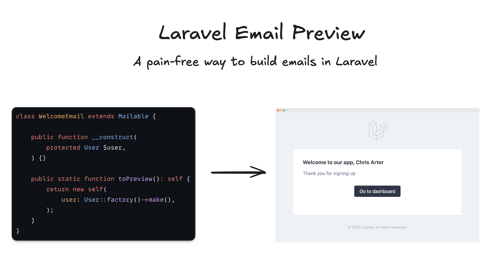

A utility for viewing emails in your browser as you develop with Laravel. This package allows you to preview your mailables without actually sending emails, making it easier to develop and test your email templates.

```php
// Make any mailable previewable
class WelcomeEmail extends Mailable implements Previewable
{
    public static function toPreview(): self
    {
        return new self(User::factory()->make());
    }
}
```
Then, view it instantly at 👀 `http://your-app.test/mail/welcome-email`


## Table of Contents

- [How to use](#how-to-use)
  - [1. Make Your Mailable Previewable](#1-make-your-mailable-previewable)
  - [2. View Your Email Preview](#2-view-your-email-preview)
  - [3. Custom Preview Slugs](#3-custom-preview-slugs)
- [Installation](#installation)
- [Requirements](#requirements)
- [Configuration](#configuration)
  - [Environment Variables](#environment-variables)
- [Security](#security)
- [Testing](#testing)
- [Contributing](#contributing)
- [Credits](#credits)
- [License](#license)


**Think of it like Factories for your emails.**

## How to use

### 1. Make Your Mailable Previewable

To make a mailable previewable, implement the `Previewable` interface and add the `toPreview()` method:

```php
class WelcomeEmail extends Mailable implements Previewable
{
    public static function toPreview(): self
    {
        return new self(
            User::factory(['name' => 'Chris Arter'])->make()
        );
    }
}
```

### 2. View Your Email Preview

Once you've made your mailable previewable, you can view it in your browser at:

```
http://your-app.test/mail/welcome-email
```

The URL slug is automatically generated from your class name:
- `WelcomeEmail` → `welcome-email`
- `OrderConfirmationMail` → `order-confirmation-mail`
- `TestMailable` → `test-mailable`


### 3. Custom Preview Slugs

You can also define a custom preview slug by adding a static property to your mailable:

```php
class WelcomeEmail extends Mailable implements Previewable
{
    public static string $previewSlug = 'welcome';
    
    // ... rest of your mailable code
}
```

Now you can access it at: `http://your-app.test/mail/welcome`

## Installation

You can install the package via Composer:

```bash
composer require dynamik-dev/laravel-mail-preview --dev
```

The package will automatically register itself with Laravel.

## Requirements

- PHP 8.4+
- Laravel 10.x, 11.x, or 12.x

## Configuration

Publish the configuration file:

```bash
php artisan vendor:publish --provider="DynamikDev\MailPreview\MailPreviewServiceProvider"
```

This will create a `config/mail-preview.php` file with the following options:

```php
return [
    // Enable or disable the mail preview
    'enabled' => env('MAIL_PREVIEW_ENABLED', false),
    
    // The route prefix for the mail preview
    'route_prefix' => env('MAIL_PREVIEW_ROUTE_PREFIX', 'mail'),
    
    // The path to discover mailables in
    'discover_path' => env('MAIL_PREVIEW_DISCOVER_PATH', base_path('app')),
];
```

### Environment Variables

To enable the mail preview, set `MAIL_PREVIEW_ENABLED` to `true` in your `.env` file.

These are the available options:

```env
MAIL_PREVIEW_ENABLED=true
MAIL_PREVIEW_ROUTE_PREFIX=mail
MAIL_PREVIEW_DISCOVER_PATH=/path/to/your/app
```

## Security

**Important**: This package should only be enabled in development environments. The mail preview routes expose your email templates and could potentially leak sensitive information.

Make sure to:

1. Set `MAIL_PREVIEW_ENABLED=false` in production
2. Add the preview routes to your middleware if needed
3. Consider using authentication middleware for the preview routes

## Testing

Run the test suite:

```bash
composer test
```

## Contributing

Please see [CONTRIBUTING.md](CONTRIBUTING.md) for details.

## Credits

- [Chris Arter](https://github.com/christopherarter)
- [All Contributors](../../contributors)

## License

The MIT License (MIT). Please see [License File](LICENSE.md) for more information.
